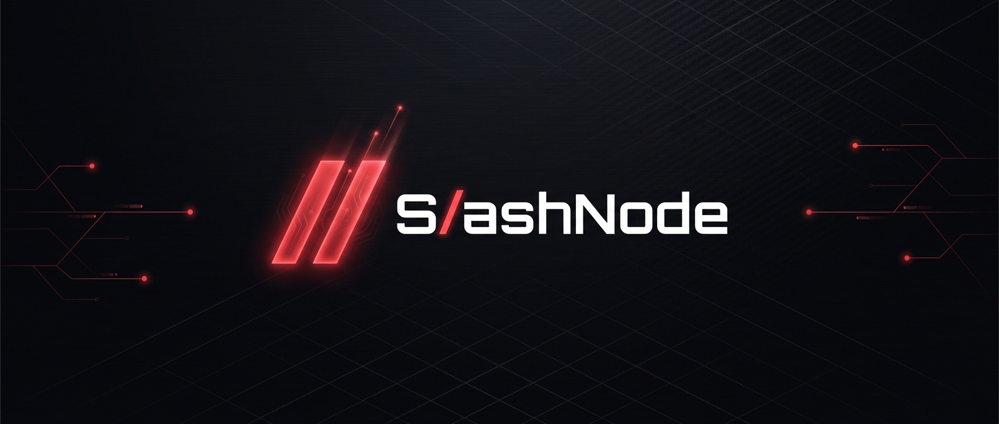

<p align="center">
  
</p>

# SlashNode

**SlashNode is an operating system for your personal server** that lets users:

- **Self-host services** — Bitcoin Core, Lightning Network (LND), Electrs,
  Mempool, Supabase, MinIO, Jitsi… in one click, with their dependencies
  installed and wired automatically.
- **Take back control of their data** — everything runs at home, on your own
  hardware; no third-party cloud, no middleman.
- **Use a friendly interface** — a web App Store (light/dark theme) to install,
  configure, update and monitor each service.
- **Stay privacy-first** — credentials are kept server-side in root-only files
  (mode `0600`), the admin password is hashed, the local API is token-protected,
  and nothing is returned to the browser or logs without an explicit action.
- **Reach it over Tor** — the SlashNode UI and any app with a web interface can
  be served as `.onion` hidden services. (Raw service endpoints — Bitcoin
  RPC/P2P, Electrum, Lightning… — are not exposed over Tor yet.)

> Under the hood it's a Go daemon (`slashnoded`) — a single binary — that
> installs on any existing Debian/Ubuntu in one line and orchestrates apps via
> Docker Compose.

## Installation

```bash
curl -fsSL https://raw.githubusercontent.com/slashbinslashnoname/slashnode/master/bootstrap.sh | bash
```

Crypto-conscious audience? Audit before running:

```bash
curl -fsSL https://raw.githubusercontent.com/slashbinslashnoname/slashnode/master/bootstrap.sh -o slashnode.sh
less slashnode.sh
bash slashnode.sh
```

The bootstrap stays minimal: it installs Docker + Node, drops the
`slashnoded` binary (checksum verified), deploys the front end and delegates all
init to `slashnoded init`. Once done, the node is reachable at
**http://slashnode.local:8080** (mDNS/Avahi).

## Access & password

During installation the bootstrap asks how the node should be reached:

- **local** (default) — reachable on your LAN as `slashnode.local`. Open by
  default; you can optionally set an admin password to require a login.
- **server** — a public address (e.g. `node.example.com`); always
  password-protected with a login page.

This is stored in `config.json` under `access` (`mode`, `address`,
`password_protected`). You can also set it non-interactively:

```bash
slashnoded init --access server --address node.example.com --password '…' --password-protect
slashnoded init --access local --password '…' --password-protect   # local + login
```

When password protection is on, the web UI redirects to a login page that
checks the admin password.

## Architecture

| Component       | Role                                                            |
|-----------------|-----------------------------------------------------------------|
| `slashnoded`    | Go daemon, single binary. Runs the local API **and** the front end. |
| Next.js front end | UI (light/dark theme, red primary), launched by the daemon.   |
| Local Go API    | `127.0.0.1`, Bearer token auth. Consumed by the front end.     |
| systemd         | `slashnoded.service` + `slashnoded-update.timer` (update check). |
| Avahi           | mDNS → `slashnode.local`.                                       |
| Docker          | Runtime for apps (JSON manifests, see `docs/app-manifest.md`).  |

```
slashnoded serve
 ├─ Go API        127.0.0.1:8081   (/api/v1/status, /api/v1/update[/apply])
 └─ next start    0.0.0.0:8080     (front end, proxies the API via the token)
```

## Commands

```
slashnoded init           # config + secrets + systemd + Avahi (idempotent)
slashnoded serve          # Go API + supervised Next.js front end
slashnoded status         # node status (--post-install: URL + credentials)
slashnoded update         # apply the latest binary update (--to <tag>)
slashnoded check-update   # check for an update (called by the timer; notify-only)
slashnoded prune          # remove dangling docker images (daily timer; on bootstrap/updates)
slashnoded uninstall      # remove service + binary (--purge: data too)
```

## Updates

**Notify-only** policy by default. The UI shows the current version (bottom
right) and, when a newer release exists, an **Update** button that updates the
**binary + web bundle + app catalog** and restarts. You can also update from the
shell:

```bash
curl -fsSL https://raw.githubusercontent.com/slashbinslashnoname/slashnode/master/update.sh | bash
# or, with the binary already installed:
slashnoded update
```

The systemd timer also checks daily and records availability in
`/var/lib/slashnode/update.json`; the API additionally does a short-cached live
check so the UI reflects new releases promptly. Configurable in `config.json`
(`update.policy`, `update.channel`).

## Development

```bash
# Front end
cd web && npm install && npm run build

# Daemon (tests without root: SLASHNODE_ROOT prefixes all paths)
export SLASHNODE_ROOT=/tmp/sn
go run ./cmd/slashnoded init
go run ./cmd/slashnoded serve --web-dir web   # front end on :8080, API on :8081
```

Build the release artifacts (amd64/arm64 + macOS binaries, web bundle):

```bash
./scripts/build.sh v0.1.0   # → dist/
```

## Apps (manifests)

Each app = a JSON manifest carrying a standard **docker-compose** document
(`compose`), `inputs` entered by the user → environment variables, and
`exports` for automatic wiring between apps. Installing an app auto-installs and
wires its dependencies (e.g. Mempool pulls in Bitcoin Core + Electrs). Any
docker-compose-only project is compatible — paste its compose into the manifest.
Per-service image versions are selectable at install and afterwards. See
**[docs/app-manifest.md](docs/app-manifest.md)** and the examples in `apps/`.

## GPU acceleration (NVIDIA)

Apps that can use a GPU show a **“Use NVIDIA GPU”** toggle on their install /
reconfigure form: **ollama**, **localai**, **photoprism**, **librechat**. When
enabled, SlashNode injects a GPU device reservation into the relevant compute
service; it is **off by default**, so apps run CPU-only and unchanged on hosts
without a GPU. The daemon detects the GPU and the form warns if you enable the
toggle on a host where none is present.

This only passes the GPU through — the **host** must provide it. On a server with
an NVIDIA GPU (e.g. a rented GPU VPS), install the driver and the **NVIDIA
Container Toolkit** once:

```bash
# 1. NVIDIA driver (use your distro's recommended driver), then:
# 2. NVIDIA Container Toolkit
curl -fsSL https://nvidia.github.io/libnvidia-container/gpgkey \
  | sudo gpg --dearmor -o /usr/share/keyrings/nvidia-container-toolkit-keyring.gpg
curl -s -L https://nvidia.github.io/libnvidia-container/stable/deb/nvidia-container-toolkit.list \
  | sed 's#deb https://#deb [signed-by=/usr/share/keyrings/nvidia-container-toolkit-keyring.gpg] https://#g' \
  | sudo tee /etc/apt/sources.list.d/nvidia-container-toolkit.list
sudo apt update && sudo apt install -y nvidia-container-toolkit
sudo nvidia-ctk runtime configure --runtime=docker
sudo systemctl restart docker

# verify the GPU is visible to Docker:
docker run --rm --gpus all nvidia/cuda:12.4.0-base-ubuntu22.04 nvidia-smi
```

Then turn on the GPU toggle for a supported app. Note that some images need a
CUDA-enabled variant to actually use the GPU — e.g. for **LocalAI** pick a
`-cublas-cuda12` image tag in the **Version** tab; **ollama** and **photoprism**
use the GPU with their default images.

## License

To be defined.
